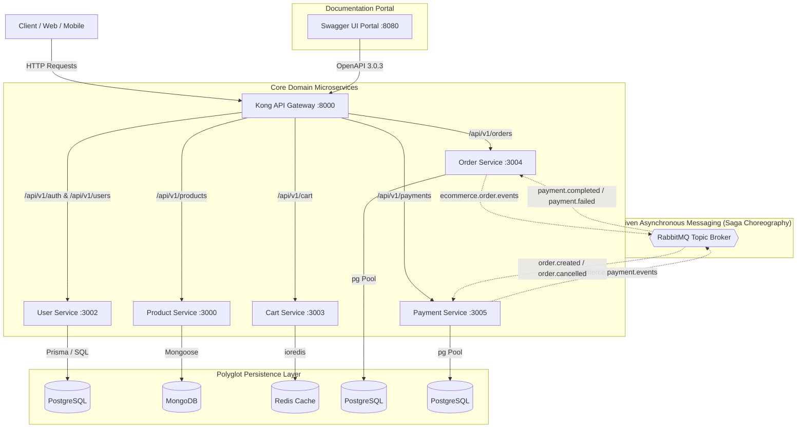
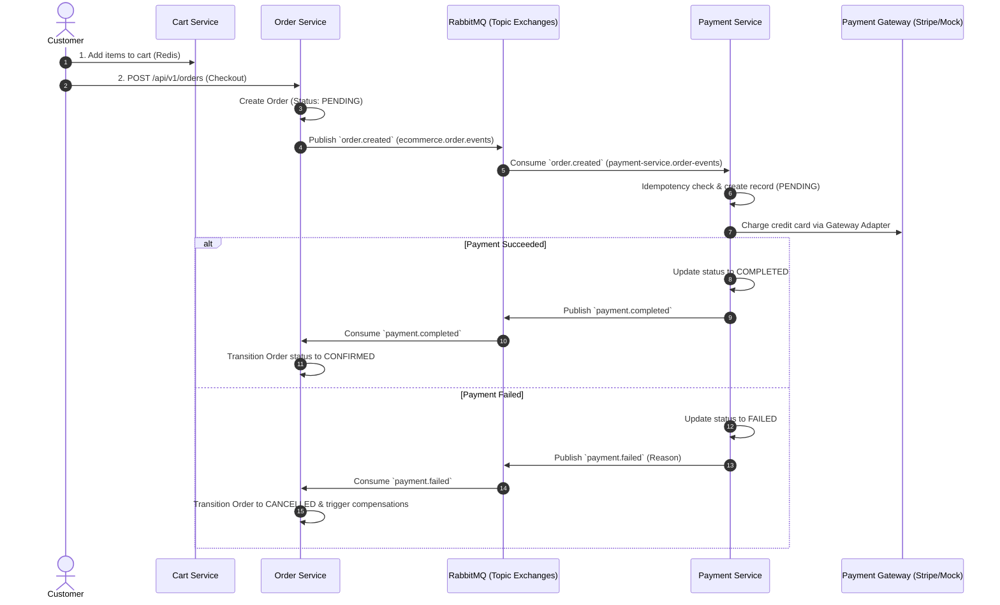

# 🛒 E-Commerce Microservices Platform

[](https://nodejs.org/)
[](https://expressjs.com/)
[](https://www.postgresql.org/)
[](https://www.mongodb.com/)
[](https://redis.io/)
[](https://www.rabbitmq.com/)
[](https://swagger.io/)
[](https://github.com/features/actions)

A production-grade, distributed microservices e-commerce backend built to fulfill the [roadmap.sh E-Commerce API](https://roadmap.sh/projects/ecommerce-api) specification.

The architecture features independent microservices, specialized polyglot persistence (PostgreSQL, MongoDB, Redis), distributed transaction management using the **Saga Choreography Pattern** over RabbitMQ topic exchanges, **Distributed Idempotency**, comprehensive **OpenAPI 3.0 Documentation** with interactive **Swagger UI**, automated **GitHub Actions CI/CD**, and cross-service **End-to-End Integration Tests**.

---

## 🏛️ System Architecture



---

## 🔄 Distributed Saga Choreography Workflow

To guarantee eventual consistency without distributed 2PC locks, order fulfillment and payment charges are coordinated using an event-driven Saga:



---

## 📦 Microservices Inventory & Technology Stack

| Service | Port | Data Store | Messaging | Key Responsibilities |
| :--- | :---: | :--- | :--- | :--- |
| **user-service** | `3002` | PostgreSQL (Prisma ORM) | — | User registration, password hashing (bcrypt), JWT generation (access & refresh tokens), profile management, RBAC (`CUSTOMER`, `ADMIN`). |
| **product-service** | `3000` | MongoDB (Mongoose) | — | High-performance catalog browsing, full-text search, multi-faceted filtering (price, category), category taxonomy, stock tracking. |
| **cart-service** | `3003` | Redis (ioredis Hashes) | — | Sub-millisecond cart mutations, atomic quantity increment/decrement, sliding expiration TTL (7 days), anonymous guest session merging. |
| **order-service** | `3004` | PostgreSQL (pg Pool) | RabbitMQ | Order aggregate creation, monetary decimal calculations, finite state machine transitions, Saga orchestrator, event publishing (`order.created`, `order.cancelled`). |
| **payment-service** | `3005` | PostgreSQL (pg Pool) | RabbitMQ | External gateway adapter (Stripe SDK + Mock), distributed idempotency key locking (`idempotency_keys`), charge capture, refund processing, Saga event consumer/publisher. |

### Shared Workspace Packages (`packages/`)

- **`@ecommerce/common-errors`**: Standardized HTTP error hierarchy (`BadRequestError`, `UnauthorizedError`, `ForbiddenError`, `NotFoundError`, `ConflictError`, `ValidationError`) and unified Express error handler middleware.
- **`@ecommerce/event-contracts`**: Centralized event schemas, topic exchanges (`ORDER`, `PAYMENT`, `INVENTORY`), and routing keys (`order.created`, `payment.completed`, etc.).
- **`@ecommerce/logger`**: Distributed request tracing context (`AsyncLocalStorage`), structured JSON logging (`winston`), HTTP request access loggers, and Prometheus metrics collectors (`prom-client`).

---

## 📖 OpenAPI 3.0 Documentation & Swagger UI

The platform provides a consolidated OpenAPI 3.0 specification covering all endpoints across all 6 services.

### Accessing Swagger UI

1. **Local Docs Server**:

   ```bash
   npm run docs
   ```

   Open [http://localhost:8080](http://localhost:8080) in your browser.

2. **Standalone HTML**:
   Simply open [`docs/index.html`](docs/index.html) in any modern browser.

3. **Raw OpenAPI Specification**:
   Located at [`docs/openapi.json`](docs/openapi.json).

---

## 🚀 Getting Started

### Prerequisites

- **Node.js**: `>= 20.0.0`
- **Package Manager**: `pnpm` (recommended) or `npm`
- **Docker & Docker Compose**: For running PostgreSQL, MongoDB, Redis, RabbitMQ, and Kong.

### 1. Clone & Install Dependencies

```bash
git clone https://github.com/dat-nnguyen/ecommerce-api.git
cd ecommerce-api

pnpm install
```

### 2. Start Infrastructure via Docker Compose

```bash
cd deployments/docker
docker compose up -d
cd ../..
```

This starts:

- **PostgreSQL**: `localhost:5434` (Order, Payment, User databases)
- **MongoDB**: `localhost:27017` (Product catalogue)
- **Redis**: `localhost:6379` (Shopping carts)
- **RabbitMQ**: `localhost:5672` (AMQP Broker) & `localhost:15672` (Management UI)
- **Kong API Gateway**: `localhost:8000` (Proxy) & `localhost:8001` (Admin API)

### 3. Run Database Migrations

```bash
# User Service (Prisma)
cd services/user-service && npx prisma migrate deploy && cd ../..

# Order Service (Raw SQL Migration)
node services/order-service/src/config/migrate.js

# Payment Service (Raw SQL Migration)
node services/payment-service/src/config/migrate.js
```

### 4. Run Services Locally

To run all services or individual services:

```bash
# Start all services concurrently (or individually)
pnpm --filter @ecommerce/user-service dev
pnpm --filter @ecommerce/product-service dev
pnpm --filter @ecommerce/cart-service dev
pnpm --filter @ecommerce/order-service dev
pnpm --filter @ecommerce/payment-service dev
```

---

## 🧪 Testing Strategy

The repository maintains a **100% test pass rate** across unit, integration, and cross-service end-to-end suites:

```bash
# Run all unit and integration test suites across the monorepo (375+ tests)
pnpm test

# Run Cross-Service End-to-End (E2E) Checkout Integration Test
pnpm run test:e2e

# Run Code Quality & Linting checks
pnpm run lint
```

### Test Coverage Highlights

- **Unit Tests**: Isolated domain tests with 100% mocked boundaries for Repositories, Adapters, Model State Machines, Event Publishers, and Consumers.
- **Integration Tests**: Supertest HTTP endpoint verification validating Zod schemas, auth middleware, and idempotency header handling.
- **End-to-End Tests** (`tests/e2e/checkout.e2e.test.js`): Simulates complete user lifecycle: registration $\rightarrow$ product selection $\rightarrow$ cart assembly $\rightarrow$ order placement $\rightarrow$ payment capture with idempotency $\rightarrow$ Saga completion & refund compensation.

---

## ⚙️ CI/CD Automation

Automated continuous integration is handled by **GitHub Actions** ([`.github/workflows/ci.yml`](.github/workflows/ci.yml)):

1. **Lint Job**: Enforces ESLint 9 code style and conventions across all packages and services.
2. **Test Job**: Runs `pnpm test` verifying all 375+ unit and integration test suites in parallel.
3. **E2E Job**: Executes the distributed cross-service checkout flow (`pnpm run test:e2e`).
4. **Concurrency Guard**: Cancels in-progress runs on new commits to save pipeline resources.

---

## 📄 License

This project is licensed under the [MIT License](LICENSE).
