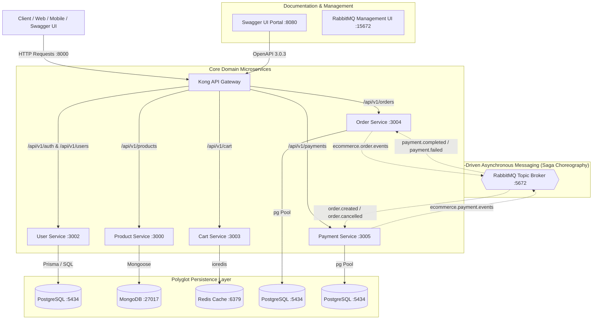
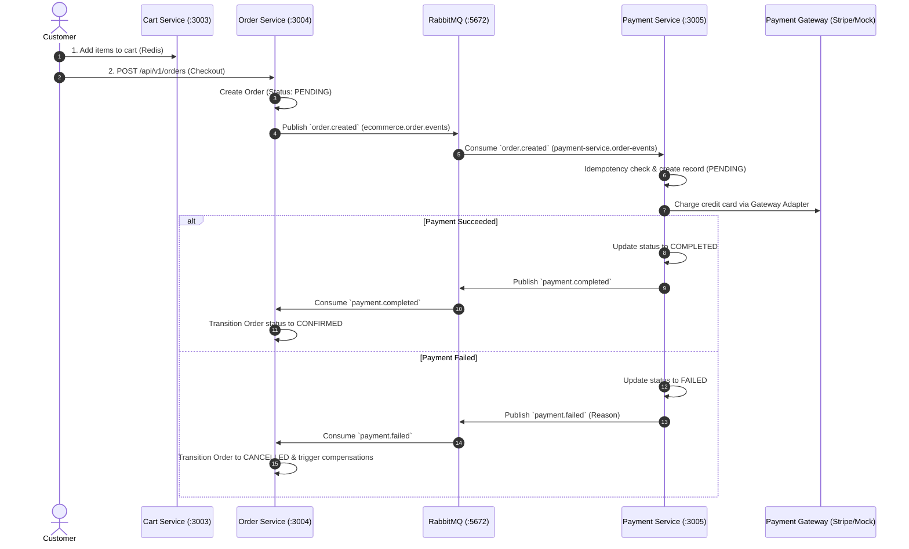

# 🛒 E-Commerce Microservices Platform

[](https://nodejs.org/)
[](https://expressjs.com/)
[](https://www.postgresql.org/)
[](https://www.mongodb.com/)
[](https://redis.io/)
[](https://www.rabbitmq.com/)
[](https://swagger.io/)
[](https://github.com/features/actions)

A production-grade, distributed microservices e-commerce backend built to fulfill the [roadmap.sh E-Commerce API]([https://roadmap.sh/projects/scalable-ecommerce-platform]) specification.

The platform is designed with independent domain microservices, specialized polyglot persistence (PostgreSQL, MongoDB, Redis), distributed transaction management using the **Saga Choreography Pattern** over RabbitMQ topic exchanges, **Distributed Idempotency**, comprehensive **OpenAPI 3.0 Documentation** with interactive **Swagger UI**, automated **GitHub Actions CI/CD**, and cross-service **End-to-End Integration Tests**.

---

## 📑 Table of Contents

- [System Architecture](#-system-architecture)
- [Microservices & Infrastructure Port Reference](#-microservices--infrastructure-port-reference)
- [Interacting with Each Service Individually](#-interacting-with-each-service-individually)
  - [1. User Service (Auth & Profiles)](#1-user-service-auth--profiles)
  - [2. Product Service (Catalog & Inventory)](#2-product-service-catalog--inventory)
  - [3. Cart Service (Redis Shopping Cart)](#3-cart-service-redis-shopping-cart)
  - [4. Order Service (Order Aggregates & Saga)](#4-order-service-order-aggregates--saga)
  - [5. Payment Service (Idempotent Gateway Charges)](#5-payment-service-idempotent-gateway-charges)
- [Cross-Service Interaction: End-to-End User Journey](#-cross-service-interaction-end-to-end-user-journey)
- [OpenAPI Documentation & Interactive Swagger UI Guide](#-openapi-documentation--interactive-swagger-ui-guide)
  - [Docs Server & Direct File Access](#docs-server--direct-file-access)
  - [Selecting the Gateway / Microservice Target](#selecting-the-gateway--microservice-target)
  - [Authenticating in Swagger UI (Authorize Button)](#authenticating-in-swagger-ui-authorize-button)
  - [Executing Live Requests ("Try it out")](#executing-live-requests-try-it-out)
- [Distributed Saga Choreography Workflow](#-distributed-saga-choreography-workflow)
- [Getting Started](#-getting-started)
- [Testing Strategy](#-testing-strategy)
- [CI/CD Automation](#-cicd-automation)
- [License](#-license)

---

## 🏛️ System Architecture



---

## 🔌 Microservices & Infrastructure Port Reference

All requests from frontend clients or Swagger UI can be routed through the **Kong API Gateway** (`http://localhost:8000`), or sent directly to individual microservices during local development:

| Service / Component     | Direct Port | Kong Gateway Route                       | Data Store           | Key Responsibilities                                                             |
| :---------------------- | :---------: | :--------------------------------------- | :------------------- | :------------------------------------------------------------------------------- |
| **Kong API Gateway**    |   `8000`    | `/` (Proxy entrypoint)                   | —                    | Unified API gateway, reverse proxy, SSL termination, rate limiting.              |
| **Kong Admin API**      |   `8001`    | —                                        | PostgreSQL           | Administrative control plane for plugins and route configuration.                |
| **User Service**        |   `3002`    | `/api/v1/auth`, `/api/v1/users`          | PostgreSQL (Prisma)  | Registration, bcrypt passwords, JWT auth tokens, user profiles, RBAC.            |
| **Product Service**     |   `3000`    | `/api/v1/products`, `/api/v1/categories` | MongoDB (Mongoose)   | Product catalog, category taxonomy, full-text search, multi-faceted filtering.   |
| **Cart Service**        |   `3003`    | `/api/v1/cart`                           | Redis (ioredis)      | High-speed shopping carts, item mutations, quantity validation, 7-day TTL.       |
| **Order Service**       |   `3004`    | `/api/v1/orders`                         | PostgreSQL (pg Pool) | Order creation, monetary calculations, Saga state machine, RabbitMQ publisher.   |
| **Payment Service**     |   `3005`    | `/api/v1/payments`                       | PostgreSQL (pg Pool) | Stripe SDK + mock gateway, distributed idempotency keys, refund processing.      |
| **Swagger UI Docs**     |   `8080`    | `/docs` (or direct)                      | Static / OpenAPI     | Interactive OpenAPI 3.0 documentation portal and API playground.                 |
| **RabbitMQ Broker**     |   `5672`    | —                                        | AMQP 0-9-1           | Topic exchanges for asynchronous Saga event orchestration.                       |
| **RabbitMQ Management** |   `15672`   | —                                        | Web Dashboard        | Visual monitoring of queues, exchanges, and message consumers (`guest`/`guest`). |
| **PostgreSQL Database** |   `5434`    | —                                        | Relational DB        | Persists Users, Orders, and Payments across isolated databases.                  |
| **MongoDB Database**    |   `27017`   | —                                        | Document DB          | Schemaless high-throughput product catalog and categories.                       |
| **Redis Cache**         |   `6379`    | —                                        | In-Memory Key-Value  | Fast shopping cart storage and session state caching.                            |

---

## 🛠️ Interacting with Each Service Individually

You can interact directly with each microservice via its individual port, or through the Kong API Gateway (`http://localhost:8000`). Below are practical `curl` examples for testing every service in isolation.

### 1. User Service (Auth & Profiles)

- **Direct URL**: `http://localhost:3002`
- **Kong Gateway URL**: `http://localhost:8000/api/v1/auth` & `http://localhost:8000/api/v1/users`

#### A. Register a New Account

```bash
curl -X POST http://localhost:8000/api/v1/auth/register \
  -H "Content-Type: application/json" \
  -d '{
    "email": "customer@example.com",
    "password": "Password123!",
    "firstName": "Alex",
    "lastName": "Mercer"
  }'
```

#### B. Log In (Retrieve Access & Refresh Tokens)

```bash
curl -X POST http://localhost:8000/api/v1/auth/login \
  -H "Content-Type: application/json" \
  -d '{
    "email": "customer@example.com",
    "password": "Password123!"
  }'
```

_Save the returned `accessToken` and user `id` for subsequent requests._

#### C. Get Current User Profile

```bash
curl -X GET http://localhost:8000/api/v1/users/profile \
  -H "Authorization: Bearer <ACCESS_TOKEN>"
```

#### D. Update User Profile

```bash
curl -X PUT http://localhost:8000/api/v1/users/profile \
  -H "Authorization: Bearer <ACCESS_TOKEN>" \
  -H "Content-Type: application/json" \
  -d '{
    "firstName": "Alexander",
    "phone": "+1-555-0199"
  }'
```

---

### 2. Product Service (Catalog & Inventory)

- **Direct URL**: `http://localhost:3000`
- **Kong Gateway URL**: `http://localhost:8000/api/v1/products`

#### A. List Products with Filtering & Pagination

```bash
curl -X GET "http://localhost:8000/api/v1/products?category=electronics&minPrice=10&maxPrice=1000&page=1&limit=10"
```

#### B. Full-Text Search

```bash
curl -X GET "http://localhost:8000/api/v1/products?search=wireless+headphones"
```

#### C. Get Product by ID

```bash
curl -X GET http://localhost:8000/api/v1/products/<PRODUCT_ID>
```

#### D. Create a New Product (Admin Role)

```bash
curl -X POST http://localhost:8000/api/v1/products \
  -H "Authorization: Bearer <ADMIN_ACCESS_TOKEN>" \
  -H "Content-Type: application/json" \
  -d '{
    "title": "Noise-Cancelling Wireless Headphones",
    "description": "Premium over-ear ANC Bluetooth headphones.",
    "price": 199.99,
    "category": "electronics",
    "stock": 50
  }'
```

---

### 3. Cart Service (Redis Shopping Cart)

- **Direct URL**: `http://localhost:3003`
- **Kong Gateway URL**: `http://localhost:8000/api/v1/cart`

> [!NOTE]
> The Cart Service accepts authentication via `x-user-id: <USER_UUID>` (authenticated user) or `x-session-id: <SESSION_UUID>` (anonymous guest).

#### A. Add Item to Cart

```bash
curl -X POST http://localhost:8000/api/v1/cart/items \
  -H "x-user-id: <USER_ID>" \
  -H "Content-Type: application/json" \
  -d '{
    "productId": "prod_anc_headphones_01",
    "quantity": 2,
    "price": 199.99,
    "title": "Noise-Cancelling Wireless Headphones"
  }'
```

#### B. View Cart Items & Calculated Totals

```bash
curl -X GET http://localhost:8000/api/v1/cart \
  -H "x-user-id: <USER_ID>"
```

#### C. Update Item Quantity in Cart

```bash
curl -X PUT http://localhost:8000/api/v1/cart/items/prod_anc_headphones_01 \
  -H "x-user-id: <USER_ID>" \
  -H "Content-Type: application/json" \
  -d '{
    "quantity": 3
  }'
```

#### D. Remove an Item from Cart

```bash
curl -X DELETE http://localhost:8000/api/v1/cart/items/prod_anc_headphones_01 \
  -H "x-user-id: <USER_ID>"
```

#### E. Clear Cart

```bash
curl -X DELETE http://localhost:8000/api/v1/cart \
  -H "x-user-id: <USER_ID>"
```

---

### 4. Order Service (Order Aggregates & Saga)

- **Direct URL**: `http://localhost:3004`
- **Kong Gateway URL**: `http://localhost:8000/api/v1/orders`

#### A. Create an Order (Triggers `order.created` Event)

```bash
curl -X POST http://localhost:8000/api/v1/orders \
  -H "x-user-id: <USER_ID>" \
  -H "Content-Type: application/json" \
  -d '{
    "items": [
      {
        "productId": "prod_anc_headphones_01",
        "title": "Noise-Cancelling Wireless Headphones",
        "quantity": 2,
        "price": 199.99
      }
    ],
    "shippingAddress": {
      "street": "100 Market St",
      "city": "San Francisco",
      "state": "CA",
      "zipCode": "94105",
      "country": "USA"
    },
    "totalAmount": 399.98
  }'
```

_Returns HTTP 201 with Order in `PENDING` state and emits an event onto RabbitMQ._

#### B. Get Order by ID

```bash
curl -X GET http://localhost:8000/api/v1/orders/<ORDER_ID> \
  -H "x-user-id: <USER_ID>"
```

#### C. List All Orders for Current User

```bash
curl -X GET "http://localhost:8000/api/v1/orders?page=1&limit=10" \
  -H "x-user-id: <USER_ID>"
```

#### D. Cancel an Order (Triggers Compensation)

```bash
curl -X POST http://localhost:8000/api/v1/orders/<ORDER_ID>/cancel \
  -H "x-user-id: <USER_ID>" \
  -H "Content-Type: application/json" \
  -d '{
    "reason": "Changed my mind"
  }'
```

---

### 5. Payment Service (Idempotent Gateway Charges)

- **Direct URL**: `http://localhost:3005`
- **Kong Gateway URL**: `http://localhost:8000/api/v1/payments`

#### A. Process Payment (With Distributed Idempotency)

```bash
curl -X POST http://localhost:8000/api/v1/payments/process \
  -H "Idempotency-Key: e82e22c0-8d5f-4a3e-b834-8bcf9a456123" \
  -H "Content-Type: application/json" \
  -d '{
    "orderId": "<ORDER_ID>",
    "amount": 399.98,
    "currency": "USD",
    "paymentMethodId": "pm_card_visa"
  }'
```

_Processes charge, saves payment as `COMPLETED`, and publishes `payment.completed` event to RabbitMQ._

#### B. Get Payment Details

```bash
curl -X GET http://localhost:8000/api/v1/payments/<PAYMENT_ID>
```

#### C. Issue a Refund

```bash
curl -X POST http://localhost:8000/api/v1/payments/<PAYMENT_ID>/refund \
  -H "Idempotency-Key: f19d44a1-7c2a-412e-a541-9a7c6e321456" \
  -H "Content-Type: application/json" \
  -d '{
    "amount": 399.98,
    "reason": "Customer cancellation"
  }'
```

---

## 🔄 Cross-Service Interaction: End-to-End User Journey

In a live e-commerce scenario, the microservices collaborate seamlessly. Below is the step-by-step workflow of a complete customer checkout lifecycle executing across all services via the Kong Gateway (`:8000`):

```
[1. Auth: Login] ──> [2. Catalog: Select] ──> [3. Cart: Redis] ──> [4. Order: PENDING]
                                                                          │ (order.created)
                                                                          ▼
[7. Order: CONFIRMED] <── [6. Saga Consumer] <── [5. Payment: COMPLETED] ◄── RabbitMQ
```

### Complete Shell Walkthrough

Run the following commands in sequence to simulate a real customer journey:

```bash
# Set Gateway Base URL
GATEWAY="http://localhost:8000"

# Step 1: Register & Authenticate User
LOGIN_RES=$(curl -s -X POST "$GATEWAY/api/v1/auth/login" \
  -H "Content-Type: application/json" \
  -d '{"email": "customer@example.com", "password": "Password123!"}')

TOKEN=$(echo $LOGIN_RES | grep -o '"accessToken":"[^"]*' | cut -d'"' -f4)
USER_ID=$(echo $LOGIN_RES | grep -o '"id":"[^"]*' | cut -d'"' -f4)
echo "✅ Authenticated. User ID: $USER_ID"

# Step 2: Browse Product Catalog
curl -s -X GET "$GATEWAY/api/v1/products?limit=2" | jq .

# Step 3: Add Selected Product to Shopping Cart (Stored in Redis)
curl -s -X POST "$GATEWAY/api/v1/cart/items" \
  -H "x-user-id: $USER_ID" \
  -H "Content-Type: application/json" \
  -d '{
    "productId": "prod_100",
    "quantity": 1,
    "price": 129.50,
    "title": "Ergonomic Mechanical Keyboard"
  }' | jq .

# Step 4: Checkout & Create Order (PostgreSQL, Initial Status: PENDING)
ORDER_RES=$(curl -s -X POST "$GATEWAY/api/v1/orders" \
  -H "x-user-id: $USER_ID" \
  -H "Content-Type: application/json" \
  -d '{
    "items": [{"productId": "prod_100", "title": "Ergonomic Mechanical Keyboard", "quantity": 1, "price": 129.50}],
    "shippingAddress": {"street": "123 Tech Blvd", "city": "Austin", "state": "TX", "zipCode": "78701", "country": "USA"},
    "totalAmount": 129.50
  }')

ORDER_ID=$(echo $ORDER_RES | grep -o '"id":"[^"]*' | cut -d'"' -f4)
echo "📦 Order Created: $ORDER_ID (Status: PENDING)"

# Step 5: Process Idempotent Payment (Triggers payment.completed Event)
IDEMPOTENCY_KEY=$(uuidgen || date +%s)
PAYMENT_RES=$(curl -s -X POST "$GATEWAY/api/v1/payments/process" \
  -H "Idempotency-Key: $IDEMPOTENCY_KEY" \
  -H "Content-Type: application/json" \
  -d "{
    \"orderId\": \"$ORDER_ID\",
    \"amount\": 129.50,
    \"currency\": \"USD\",
    \"paymentMethodId\": \"pm_card_visa\"
  }")
echo "💳 Payment Processed: $PAYMENT_RES"

# Step 6: Verify Event-Driven Saga Completion
# RabbitMQ delivers payment.completed to Order Service -> Transitions status to CONFIRMED
sleep 1
FINAL_ORDER=$(curl -s -X GET "$GATEWAY/api/v1/orders/$ORDER_ID" -H "x-user-id: $USER_ID")
echo "🎉 Final Order State:"
echo $FINAL_ORDER | jq .
```

---

## 📖 OpenAPI Documentation & Interactive Swagger UI Guide

The repository includes a consolidated OpenAPI 3.0.3 specification covering all endpoints, parameters, schemas, and security definitions across all microservices.

### Docs Server & Direct File Access

You can access the interactive Swagger UI portal in two ways:

1. **Local Documentation HTTP Server (Port `8080`)**:

   ```bash
   pnpm run docs
   # or: npm run docs / node docs/server.js
   ```

   Open your browser at: **[http://localhost:8080](http://localhost:8080)**

2. **Direct Browser File Access (No Server Required)**:
   Double-click or open [`docs/index.html`](docs/index.html) directly in Chrome, Firefox, Safari, or Edge.

3. **Raw OpenAPI JSON Specification**:
   Available at [`docs/openapi.json`](docs/openapi.json) or via HTTP at `http://localhost:8080/openapi.json`.

---

### Selecting the Gateway / Microservice Target

At the top of the Swagger UI interface, locate the **Servers** dropdown:

```
Servers: [ http://localhost:8000 - Kong API Gateway (Unified Entrypoint) ▼ ]
```

- **Kong API Gateway (`http://localhost:8000`)** _(Default & Recommended)_:
  Routes requests through Kong to all microservices automatically. All paths `/api/v1/*` are fully functional.
- **Direct Microservices (`http://localhost:3002`, `3000`, `3003`, `3004`, `3005`)**:
  Select a specific microservice port if you are developing or testing that microservice in isolation without running the Kong container.

---

### Authenticating in Swagger UI (Authorize Button)

Many endpoints (e.g. User Profile, Order Checkout, Admin Product Management) require authentication. Swagger UI provides built-in authorization support:

1. Click the green **Authorize 🔓** button in the top right corner.
2. In the modal, configure the relevant security scheme:
   - **`BearerAuth` (HTTP Bearer JWT)**:
     - Paste your JWT access token (obtained from `POST /api/v1/auth/login`).
     - Value format: `<YOUR_JWT_TOKEN>` (Swagger UI automatically prefixes `Bearer `).
   - **`UserIdAuth` (`x-user-id` Header)**:
     - Enter your user UUID string.
3. Click **Authorize**, then click **Close**.
4. The lock icon will change to **Locked 🔒**, indicating that all subsequent requests will include your authentication credentials automatically.

---

### Executing Live Requests ("Try it out")

Every endpoint in Swagger UI is fully interactive:

1. **Expand Endpoint Card**: Click on any route (e.g. `POST /api/v1/cart/items` or `POST /api/v1/orders`).
2. **Enable Input**: Click the **Try it out** button in the top right corner of the endpoint card.
3. **Customize Payload**: The request body is pre-populated with valid example JSON. Edit the parameters or payload values as needed.
4. **Execute**: Click the blue **Execute** button.
5. **Inspect Live Response**:
   - **Generated curl command**: View the equivalent CLI command.
   - **Request URL**: View the exact target URL called.
   - **Server response**: HTTP status code (`200`, `201`, `400`, `404`, etc.), response headers, and formatted JSON body.

---

## 🔄 Distributed Saga Choreography Workflow

Order checkout and payment charges are coordinated using an event-driven Saga without distributed 2PC locks:



---

## 🚀 Getting Started

### Prerequisites

- **Node.js**: `>= 20.0.0`
- **Package Manager**: `pnpm` (recommended) or `npm`
- **Docker & Docker Compose**: For running PostgreSQL, MongoDB, Redis, RabbitMQ, and Kong.

### 1. Clone & Install Dependencies

```bash
git clone https://github.com/dat-nnguyen/ecommerce-api.git
cd ecommerce-api

pnpm install
```

### 2. Start Infrastructure via Docker Compose

```bash
cd deployments/docker
docker compose up -d
cd ../..
```

This starts:

- **PostgreSQL**: `localhost:5434` (User, Order, Payment databases)
- **MongoDB**: `localhost:27017` (Product catalogue)
- **Redis**: `localhost:6379` (Shopping carts)
- **RabbitMQ**: `localhost:5672` (AMQP Broker) & `localhost:15672` (Management UI)
- **Kong API Gateway**: `localhost:8000` (Proxy) & `localhost:8001` (Admin API)

### 3. Run Database Migrations

```bash
# User Service (Prisma)
cd services/user-service && npx prisma migrate deploy && cd ../..

# Order Service (Raw SQL Migration)
node services/order-service/src/config/migrate.js

# Payment Service (Raw SQL Migration)
node services/payment-service/src/config/migrate.js
```

### 4. Run Services Locally

```bash
# Start services individually or in parallel
pnpm --filter @ecommerce/user-service dev
pnpm --filter @ecommerce/product-service dev
pnpm --filter @ecommerce/cart-service dev
pnpm --filter @ecommerce/order-service dev
pnpm --filter @ecommerce/payment-service dev

# Start Swagger UI Documentation Server (Port 8080)
pnpm run docs
```

---

## 🧪 Testing Strategy

The repository maintains a **100% test pass rate** across unit, integration, and cross-service end-to-end suites:

```bash
# Run all unit and integration test suites across the monorepo (375+ tests)
pnpm test

# Run Cross-Service End-to-End (E2E) Checkout Integration Test
pnpm run test:e2e

# Run Code Quality & Linting checks
pnpm run lint
```

### Test Coverage Highlights

- **Unit Tests**: Isolated domain tests with 100% mocked boundaries for Repositories, Adapters, Model State Machines, Event Publishers, and Consumers.
- **Integration Tests**: Supertest HTTP endpoint verification validating Zod schemas, auth middleware, and idempotency header handling.
- **End-to-End Tests** ([`tests/e2e/checkout.e2e.test.js`](tests/e2e/checkout.e2e.test.js)): Simulates complete user lifecycle: registration $\rightarrow$ product selection $\rightarrow$ cart assembly $\rightarrow$ order placement $\rightarrow$ payment capture with idempotency $\rightarrow$ Saga completion & refund compensation.

---

## ⚙️ CI/CD Automation

Automated continuous integration is handled by **GitHub Actions** ([`.github/workflows/ci.yml`](.github/workflows/ci.yml)):

1. **Lint Job**: Enforces ESLint 9 code style and conventions across all packages and services.
2. **Test Job**: Runs `pnpm test` verifying all 375+ unit and integration test suites in parallel.
3. **E2E Job**: Executes the distributed cross-service checkout flow (`pnpm run test:e2e`).
4. **Concurrency Guard**: Cancels in-progress runs on new commits to save pipeline resources.

---

## 📄 License

This project is licensed under the [MIT License](LICENSE).
